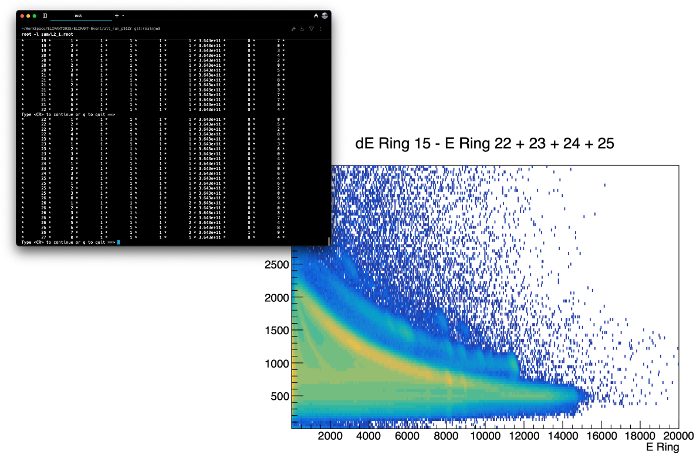

## ELIFANT-Event: A Software System for Data Management and Pre-Analysis



<div style="page-break-before:always"></div>

### Overview

**ELIFANT-Event** is a software system designed to manage, process, and analyze data acquired by the Digital ELI-NP Listmode Acquisition (DELILA) system. It facilitates event reconstruction based on user-defined trigger detectors and logical conditions, enabling detailed analysis of experimental results. This document provides a guide for installation, configuration, and utilization of the software.

### Getting Started

#### 1. System Requirements & Installation

The ELIFANT-Event software is available for download from its official GitHub repository ([https://github.com/aogaki/ELIFANT-Event](https://github.com/aogaki/ELIFANT-Event)).  Building the software requires CMake and ROOT as dependencies. The following steps outline the installation process:

1.  **Clone the Repository:** Obtain a local copy of the source code using Git:
    ```bash
    git clone https://github.com/aogaki/ELIFANT-Event.git
    cd ELIFANT-Event
    ```

2.  **Create Build Directory:** It is recommended to create a dedicated build directory, often named after the run number (e.g., `run123`), to maintain organization and facilitate updates:
    ```bash
    mkdir run123
    cd run123
    ```

3.  **Configure and Build:** Utilize CMake to configure the project and generate build files, followed by compilation using `make`:
    ```bash
    cmake ..
    make
    ```

The software leverages features available in C++17 or later, specifically `std::filesystem`, for file system operations. A CMake version of 3.5 or higher is also required.  Git is necessary for initial cloning and subsequent updates to the codebase.

#### 2. Initializing Configuration Files

After successful compilation, initialize the configuration files using the following command:

```bash
./eve-builder -i

Initializing the event builder...
Please enter the following information:
What is the data directory? (default: /Users/aogaki/WorkSpace/ELIFANT2025/3He12C/data/): 
What is the run number? (default: 76): 123
What is the start version? (default: 0): 
What is the end version? (default: 173): 9999
What is the time window? (default: 300): 1000
What is the coincidence window? (default: 300): 100
How many modules? (default: 11): 
How many channels of module 0? (default: 32): 16
How many channels of module 1? (default: 16): 16
How many channels of module 2? (default: 16): 
How many channels of module 3? (default: 16): 
How many channels of module 4? (default: 16): 
How many channels of module 5? (default: 16): 
How many channels of module 6? (default: 16): 
How many channels of module 7? (default: 16): 
How many channels of module 8? (default: 16): 32
How many channels of module 9? (default: 32): 
How many channels of module 10? (default: 32): 16
What is the time reference module? (default: 9): 
What is the time reference channel? (default: 0): 
What is the channel settings file name? (default: chSettings.json): 
What is the L2 settings file name? (default: L2Settings.json): 
Generating settings template...
settings.json generated.
chSettings.json generated.
Initialization completed.
```

The software will prompt for essential information regarding the data acquisition setup. The required inputs include:

*   **Data Directory:**  The location of the raw data files.
*   **Run Number & Version Range:** Specifies the range of data versions to be processed.
*   **Time Offset File:** Path to a file containing pre-calculated time offsets (if applicable).

These parameters are stored in `settings.json` and `chSettings.json`, which define the overall experiment configuration and channel-specific properties, respectively.


#### 3. Time Calibration

Before performing event reconstruction, it is essential to generate time alignment corrections to synchronize all detector channels. This process calculates time offsets between channels to account for differences in cable lengths, electronics delays, and other timing variations:

```bash
./eve-builder -t
```

**Important:** Time calibration is performed only for channels with `"IsEventTrigger": true` in the `chSettings.json` configuration file. Non-trigger channels are excluded from the time alignment process.

This step performs the following operations:

1.  **Data Loading:** Processes the raw data files specified in the configuration to extract timing information from trigger-enabled detector channels only.
2.  **Time Difference Histograms:** Creates 2D histograms showing time differences between each trigger detector channel and all other trigger channels in the system.
3.  **Peak Finding:** Analyzes the time difference distributions to identify the peak positions (maximum histogram height), which represent the optimal time offsets needed for synchronization.
4.  **Offset Calculation:** Calculates time alignment corrections based on the peak positions, with different binning strategies applied for different detector types (AC detectors: 10× rebinning, HPGe detectors: 100× rebinning). The timing information corresponds to the bin center where the histogram reaches its maximum height.
5.  **Output Generation:** Saves the timing histograms to `timeAlignment.root` and generates `timeSettings.json` containing the calculated time offsets for each channel pair.

The time calibration results are used automatically in subsequent L1 event building to ensure proper temporal alignment of all detector signals. **Note:** This calibration step should be performed whenever the experimental setup changes or when processing data from a new run series.

#### 4. Event Reconstruction – L1 Event Building

The initial event reconstruction stage, referred to as L1 event building, involves applying time calibration and identifying events based on trigger conditions. This process is initiated with:

```bash
./eve-builder -l1
```

This step performs the following operations:

1.  **Data Loading & Time Correction:** Loads data files, applies time offsets derived from a separate calibration procedure (see section 3), and corrects for timing discrepancies.
2.  **Trigger Identification:** Identifies detectors designated as trigger elements (`IsEventTrigger` flag in `chSettings.json`).
3.  **Coincidence Search:** Searches for events occurring within a defined coincidence window, identifying potential correlated signals. Events are filtered to avoid double-counting based on detector ID priority (lower IDs take precedence).
4. **AC Detector Check**: Checks if the event has AC detector in the coincidence window or not.
5.  **Event Storage:** Stores reconstructed events in a ROOT file (`L1_N.root`) containing a TTree structure for efficient data access and analysis.

The time calibration algorithm employed is based on histogramming time differences between reference detectors and other channels, identifying the peak position as the optimal time offset. **Caution:** This method may be less effective with detectors exhibiting long decay tails (e.g., Germanium detectors). In such cases, a wider coincidence window and manual adjustment of time offsets are recommended.

#### 5. Advanced Event Selection – L2 Event Selection

The L2 event selection stage allows for the application of user-defined criteria to further refine the event sample. This process requires a configuration file (`L2Settings.json`) defining logical conditions based on detector signals.  An example structure is provided below:

```json
[
    {
        "Type": "Counter",
        "Name": "E_Sector_Counter",
        "Tags": [
            "E_Sector"
        ]
    },
    {
        "Type": "Counter",
        "Name": "dE_Sector_Counter",
        "Tags": [
            "dE_Sector"
        ]
    },
    {
        "Name": "dE_More_Than_0",
        "Type": "Flag",
        "Monitor": "dE_Sector_Counter",
        "Operator": ">",
        "Value": 0
    },
    {
        "Name": "E_More_Than_0",
        "Type": "Flag",
        "Monitor": "E_Sector_Counter",
        "Operator": ">",
        "Value": 0
    },
    {
        "Name": "Si_Both",
        "Type": "Accept",
        "Monitor": [
            "E_More_Than_0",
            "dE_More_Than_0"
        ],
        "Operator": "AND"
    }
]
```

This configuration defines three entry types: `Counter`, `Flag`, and `Accept`.  `Counter` entries tally events associated with specific detector tags. `Flag` entries set boolean flags based on counter values using defined operators (e.g., ">", "<", "=="). Finally, `Accept` entries determine whether an event is accepted based on logical combinations of flag values (e.g., "AND", "OR").

To initiate L2 event selection:

```bash
./eve-builder -l2
```

The software loads the L1 output file (`L1_N.root`), applies the criteria defined in `L2Settings.json`, and stores the selected events in a new ROOT file (`L2_N.root`).  Both counter values and flag states are also recorded within this file for further analysis.


#### 6. Data Analysis

The software package includes example C++ macros located in the `macro` directory to facilitate data analysis using ROOT. These macros demonstrate basic functionalities such as histogramming, fitting, and event selection. To execute a macro:

```bash
root -l reader.cpp+O
```

This command compiles and runs the specified macro (`reader.cpp`), generating output files (e.g., `results.root`) containing analysis results. Users can modify these macros or develop new ones to perform customized analyses tailored to their specific research needs. Those examples are making several threads. The number of threads is as same as the number of L2 files. If you want to use only one thread, using TChain and writing your own macro is recommended.


### Support & Acknowledgements

For further assistance, please contact Soiciro Aogaki at sohichiroh.aogaki@eli-np.ro.  Contributions, bug reports, and feature requests are welcome via the GitHub repository issue tracker or through direct email communication.

This project is developed by the Gamma Driven Experiment Group (GDED) at ELI-NP. The software builds upon the DELILA data acquisition system and aims to streamline the analysis of experimental data from the ELIFANT campaign. This work is supported by the ELI-RO program funded by the Institute of Atomic Physics, Magurele, Romania, under contract numbers ELI-RO/RDI/2024-002 (CIPHERS) and ELI-RO/RDI/2024-007 (ELITE), as well as by the Romanian Ministry of Research and Innovation through research contracts PN 23 21 01 06.
